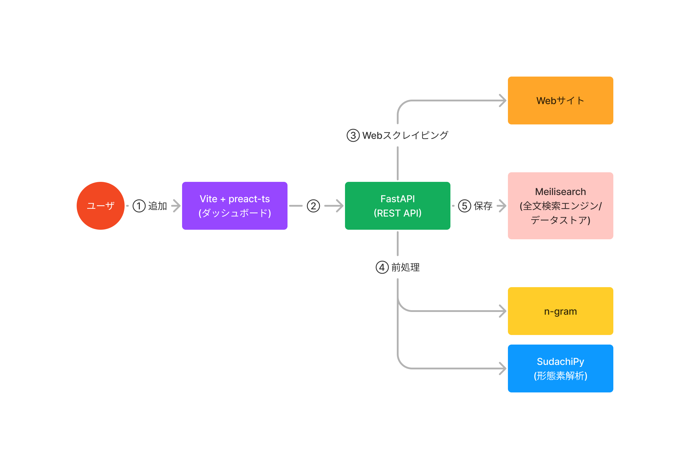

# Osakana


「あとで読む」記事を管理できるWebアプリ

## アーキテクチャ



## ユーザガイド

ユーザとして利用する場合、DockerとDocker Composeによる構築を推奨します。

```bash
# `server/.env` の以下の項目を変更する
$ cat server/.env
...
+ API_ADDRESS=0.0.0.0
- API_ADDRESS=127.0.0.1
...
+ MS_ADDRESS=engine
- MS_ADDRESS=localhost
...

# Dockerネットワークの作成
$ make network

# Dockerイメージのビルド
$ make build

# Dockerコンテナの起動
$ make up

# Dockerコンテナの停止
$ make down
```

## 開発者ガイド

開発者として利用する場合、設定変更の容易であることやホットリロードを利用できる等の理由から、以下のドキュメントに従ってホストマシン上に直接構築することを推奨します。

- [全文検索エンジン(Meilisearch)](./engine/README.md)
- [サーバ(FastAPI)](./server/README.md)
- [ダッシュボード(Vite + preact-ts)](./dashboard/README.md)
